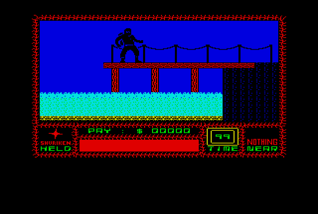
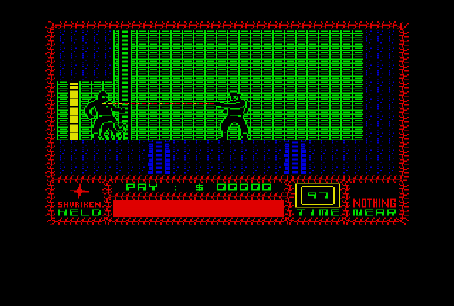

# uknc-saboteur1

Porting Saboteur game from ZX Spectrum to UKNC.

### Project Status

Work in Progress

### Screenshots

 

### Code Structure

 - `SABOT1.MAC`: system-specific code, PPU code etc.
 - `S1CORE.MAC`: game logic
 - `S1PICT.MAC`: RLE encoded sequence for menu picture
 - `S1FONT.MAC`: font definition
 - `S1INDS.MAC`: RLE encoded sequence for game frame, plus the frame tiles
 - `S1ROOM.MAC`: room structures
 - `S1SPRT.MAC`: sprites as blocks of tiles
 - `S1TILE.MAC`: tiles

### Tools

 - [macro11](https://gitlab.com/Rhialto/macro11) cross-compiler
 - [pclink11](https://github.com/nzeemin/pclink11) cross-linker
 - [UKNCBTL utilities](https://github.com/nzeemin/ukncbtl-utils): `rt11dsk` to work with disk images

Emulators of the machine, to test the result:
 - [UKNCBTL](https://github.com/nzeemin/ukncbtl)
 - [EmuStudio](https://zx-pk.ru/threads/18027-emulyator-uknts-emustudio.html)

### Credits

Original game by Clive Townsend for ZX Spectrum.

### See Also

 - [Saboteur ZX Spectrum disassembly](https://nzeemin.github.io/skoolkit-game-revs/saboteur1-zx/saboteur/)
